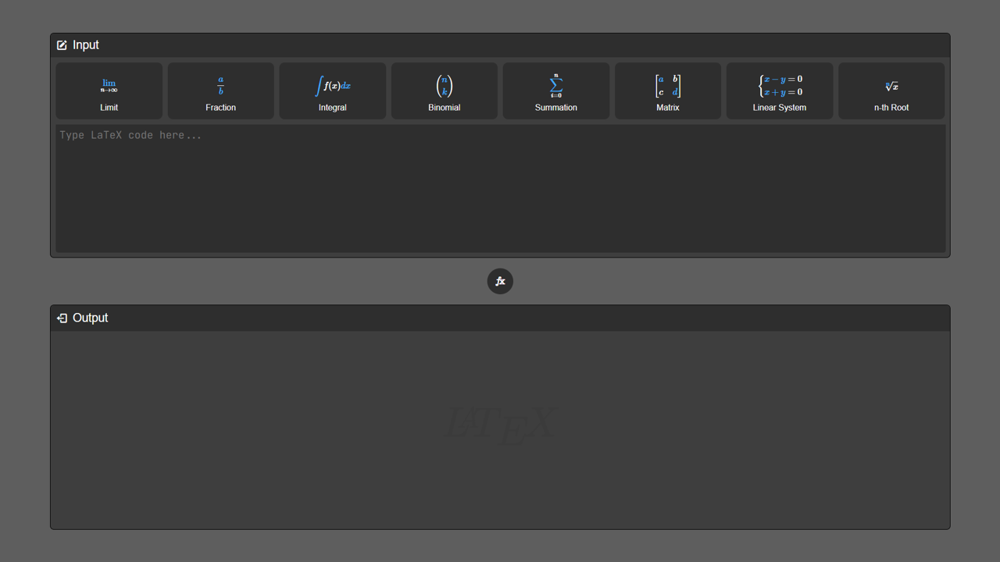

# LaTeX數學算式顯示器 LaTeX Math Equation Display

這是一個LaTeX算式顯示器，使用者可以輸入LaTeX程式碼，並透過轉換按鈕顯示其LaTeX數學算式。此工具使用HTML、CSS和JavaScript製作，並且結合了MathJax庫來渲染LaTeX公式。\
This is a LaTeX equation display tool where users can input LaTeX code and display the corresponding LaTeX math equations by clicking the convert button. This tool is made using HTML, CSS, and JavaScript, and it incorporates the MathJax library to render LaTeX formulas.

## 功能 Features

- 顯示LaTeX數學算式。Display LaTeX math equations.
- 支援各種數學符號和表達式。Support for various mathematical symbols and expressions.
- 有「常用」項目，可快速插入LaTeX程式碼。"Common" items for quickly inserting LaTeX code.

## 截圖 Screenshot

Reference：https://www.latexlive.com/